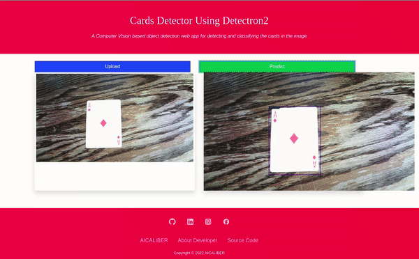

<p align="center">
    <b>
        <h1 align="center">♠ Cards Detector ♠</h1>
    </b>
</p>
<p align="center">
    <em>A Computer Vision based object detection web app for detecting and classifying the cards in the image</em>
</p>

<p align="center">
    <a href="https://github.com/Hassi34/CardsDetector-Detectron2/blob/main/LICENSE">
        
    </a>
    <a href="https://github.com/Hassi34/CardsDetector-Detectron2">
        
    </a>
    <a href="https://github.com/Hassi34/CardsDetector-Detectron2">
        
    </a>
    <a href="https://github.com/Hassi34/CardsDetector-Detectron2">
        
    </a>
</p>
<p align="center">
    
</p>

## Overview
This is a web app to detect and classify images. Users can use the web interface or the REST API<br>
Following are the major contents to follow, you can jump to any section:

>   1. [Live Project Link](#)
>   2. [Run Locally](#run-local)
>   3. [Model Training](https://github.com/Hassi34/CardsDetector-Detectron2/blob/main/CardsDetectorCustomTrainingDetectron2.ipynb)
>   4. [REST API](#rest-api)
### 🔗 Project Link<a id='live-project'></a>
Check out the deployed app [here](#)

## Run Locally<a id='run-local'></a>

Clone the project

```bash
  git clone https://github.com/Hassi34/CardsDetector-Detectron2
```

Go to the project directory

```bash
  cd CardsDetector-Detectron2
```

Install dependencies

```bash
  pip install -r requirements.txt
```

Start the server

```bash
  python app.py
```
## REST API<a id='rest-api'></a>
```python
import requests
import base64

IN_IMG_PATH = "card.jpg"
OUT_IMG_PATH = "result.jpg"
ENDPOINT = "http://127.0.0.1:5000/predict"

def decodeImage(imgstring, OUT_IMG_PATH):
    imgdata = base64.b64decode(imgstring)
    with open(OUT_IMG_PATH, 'wb') as f:
        f.write(imgdata)
        f.close()


def encodeImageIntoBase64(IN_IMG_PATH):
    with open(IN_IMG_PATH, "rb") as f:
        return base64.b64encode(f.read())

if __name__ == '__main__':

    BASE64_STR = encodeImageIntoBase64(IN_IMG_PATH).decode("utf-8")
    res = requests.post(ENDPOINT, json={"image":BASE64_STR})

    if res.status_code == 200:
        res = res.json()
        decodeImage(res["image"], OUT_IMG_PATH)
    else :
        print(res)
```
**Note**:**It is strongly recommended to use the Linux environment while running the project locally**

**Copyright &copy; 2022 Hasanain** <br>
Let's connect on **[``LinkedIn``](https://www.linkedin.com/in/hasanain-mehmood)** <br>